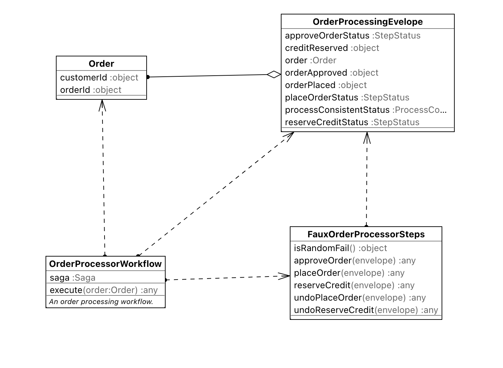

# typescript-saga-example

An example **typescript saga orchestration**, based on the example from https://www.npmjs.com/package/node-sagas.

## state machine

This example implements the following **saga state machine** ...

The state machine has the following possible exit states:

- **A** the **happy** path.
- **B** a **_fully successful_ recovery** path.
- **C** a **_partially failed_ recovery** path.
- **D** a **_completely failed_ recovery** path.

## object model

This example implements the following **object model** ...

